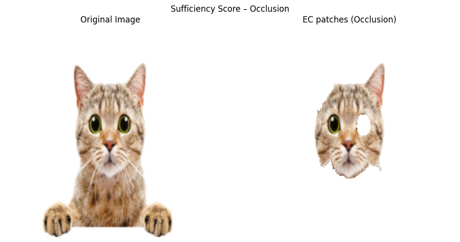

# XAI-project
## Quantitatively evaluating explainability: Benchmarking XAI Techniques for image classification tasks

This project benchmarks explainability methods for binary image classification using semantically grounded regions extracted with Grounded-SAM.

We evaluate both gradient-based (e.g., Integrated Gradients, Grad-CAM) and perturbation-based (e.g., LIME, Kernel SHAP) methods over the same interpretable input space.

### Main Contributions
- Use of semantic masks (e.g., head, ears, tail) instead of superpixels or raw pixels
- Fair evaluation across multiple XAI methods and CNNs (ResNet18, VGG16, MobileNetV2)
- Quantitative comparison using:
  - Effective Compactness
  - Rank Quality Index (RQI)
  - Stability
  - Sufficiency Score
  - Valley Score
  - Execution Time

  

 
  <b>Image</b> Example of patches working for Sufficiency Score (Occlusion, ResNet-18 , Cats and Dogs dataset).

### Datasets
- [Cars vs. Bikes](https://www.kaggle.com/datasets/utkarshsaxenadn/car-vs-bike-classification-dataset)
- [Cats vs. Dogs](https://www.kaggle.com/datasets/samuelcortinhas/cats-and-dogs-image-classification)

### Notebooks
- `single_sample_Resnet18_CatsDogs.ipynb`: full pipeline example on one image
- A base implementation using standard SAM, which does not require human input is available at `/others/SAM_starting_pipeline.ipynb`

This project is part of a research paper on benchmarking XAI for visual binary classification.

> Developed by Mattia Viglino, Vincenzo Montana and Anna Lisa Maddaloni as part of the Explainable AI course at Politecnico di Torino 2025.
